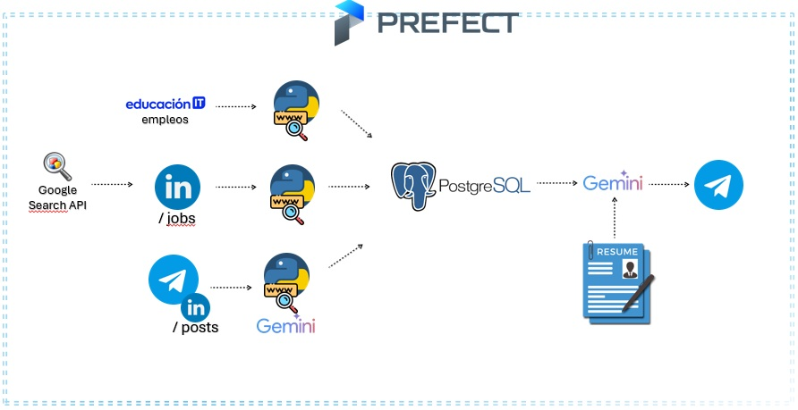
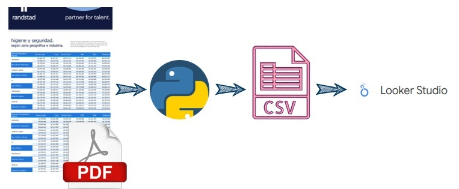

# Portfolio personal 
🐧 Me llamo Leandro Joel Torres, este es mi portfolio personal para reclutadores o cualquier interesado en los proyectos 🐧

# Proyectos

## [JobScraper AI : - Scraping y recomendación de empleos con Gemini y Prefect](https://github.com/suri2006/Portfolio/tree/main/JobScraper_AI)
JobScraper AI es un proyecto personal que busca automatizar la búsqueda de empleo. Recolecta ofertas desde páginas web y grupos de Telegram, guarda los datos en una base PostgreSQL local, analiza tu currículum en PDF y genera recomendaciones usando Gemini. Luego, te envía esas sugerencias directamente por Telegram. Todo el proceso está orquestado con Prefect para que funcione de forma diaria y sin intervención manual.

## [RANDSTAD PROJECT : Extracción de tablas y DASHBOARD (Python-Looker](https://github.com/suri2006/Portfolio/tree/main/Randstad_Project)
Proyecto personal de extracción de todas tablas de los reportes salariales de Randstad que se encuentran en PDF con python.

## [POKEMON PROJECT : ETL(ApiPokemon)-DASHBOARD (Python-Power BI - MySQL](https://github.com/suri2006/Portfolio/tree/main/Pokemon_ETL_dashboard)
Proyecto personal de un ETL, extrayendo datos de la api de pokémon:
https://pokeapi.co/
El ETL es realizado por python luego subido a en MySQL local, para posteriormente realizar el dashboard en Power BI conectado a la base de datos MySQL

## [ETL_ALKEMY_CHALLENGE (Python-PostgreSQL) [MAYO 2022]](https://github.com/suri2006/Portfolio/tree/main/Alkemy_ETL_challenge)
Proyecto de la aceleradora Alkemy, en un proceso de ETL, extrae datasets de una plataforma del gobierno , se transforman y se suben a una base de datos en PostgreSQL
Todo mediante el uso de Python 

## [Data analysis with Python-Freecodecamp-Projects [ABRIL 2022]](https://github.com/suri2006/Portfolio/tree/main/PythonProjects_DataAnalysis_FreeCodeCamp)
Proyectos realizados con python usando las librerias Pandas, Seaborn, Numpy ,Scipy y Matplotlib. Para obtener el certificado de Freecodecamp

## [Dashboard Spotify (Excel-PowerBI) [MARZO 2022]](https://github.com/suri2006/Portfolio/tree/main/3_Spotify)
Analísis de datos de un dataset de Kaggle sobre datos de canciones de Spotify, realizado con Excel para la limpieza de datos y PowerBi para el dashboard

 
  
## [DashBoard Disney+ (MySQL-PowerBI) [MARZO 2022]](https://github.com/suri2006/Portfolio/tree/main/2_Proyecto_DisneyPlus_Analytics)
Analísis de datos de un dataset de Kaggle sobre datos de péliculas y shows en Disney+, realizado con MySQL para la limpieza de datos y PowerBi para el dashboard

## [Data Analytics CODERHOUSE (Excel - PowerBI) [FEBRERO 2022]](https://github.com/suri2006/Portfolio/tree/main/ProyectoFinal_DataAanalytics_CODERHOUSE)
Analísis de datos de los sueldos en diseño grafico en España, limpieza de datos con Excel y PowerBi para el dashboar 

## [Creación de una base de datos para un local de venta de jugos ficticio (MySQL) [FEBRERO 2022]](https://github.com/suri2006/Portfolio/tree/main/1_Proyecto_Base_de_dato_mysql)
Creamos una base de datos para emular un negocio de venta de jugos, realizando la facturación, cargando el stock y clientes

